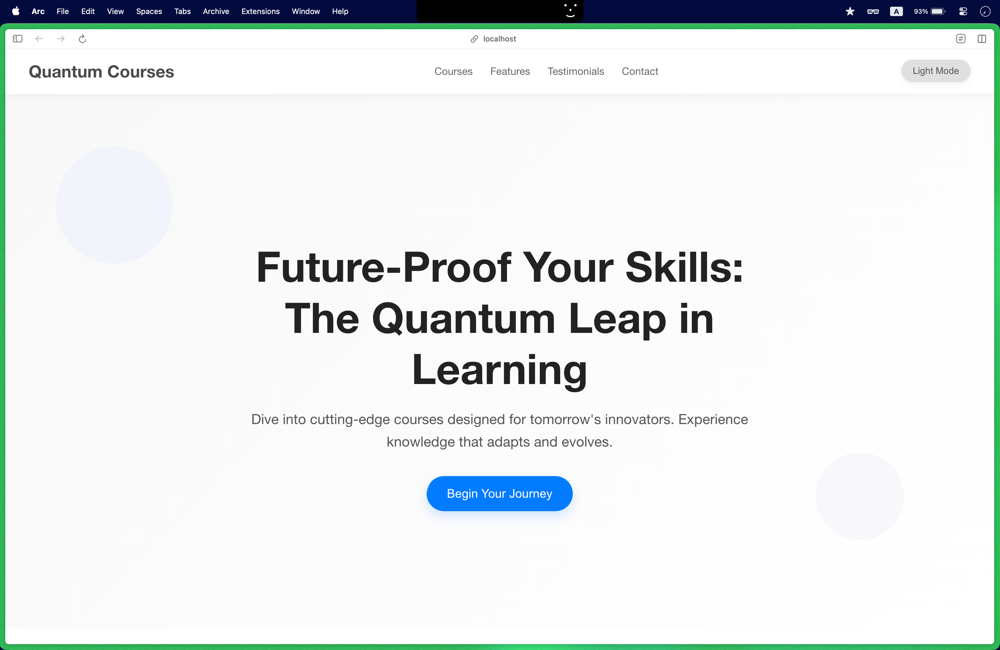
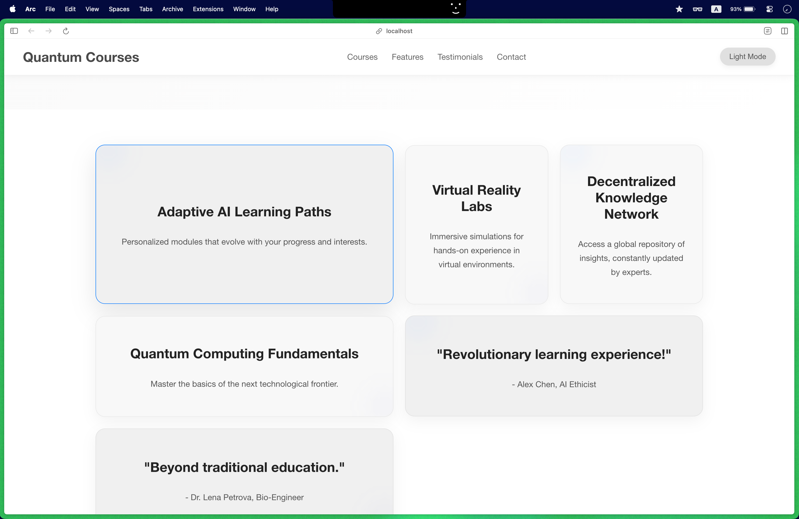
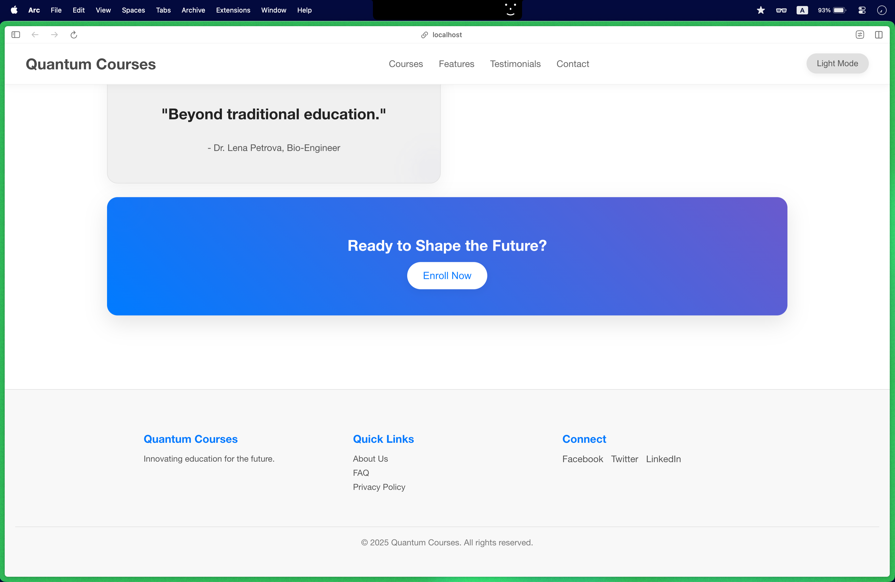
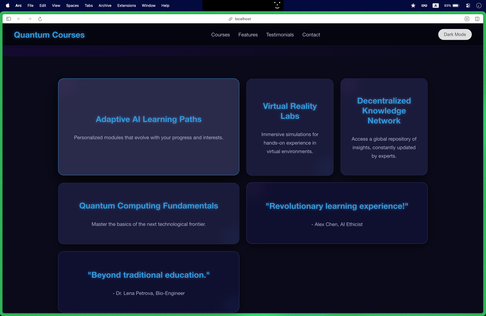
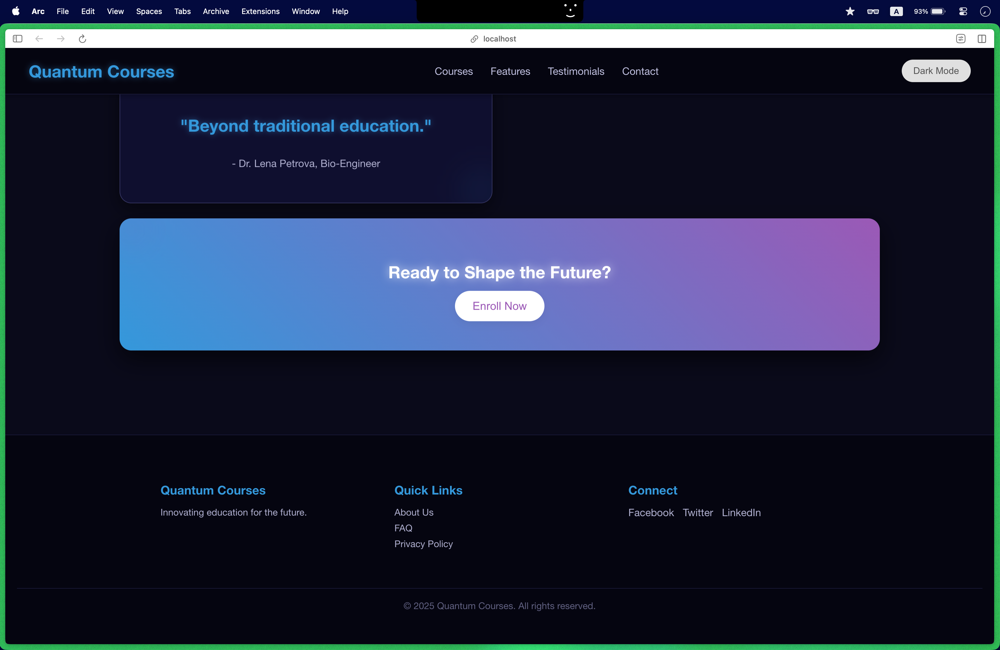

# 🌌 Quantum Courses Landing Page

A modern, responsive landing page UI designed to showcase and promote **quantum computing courses**. Built as a test project using the **[Gemini CLI](https://github.com/google-gemini/gemini-cli)** in a terminal-based workflow, this project aims to provide a sleek and informative gateway for potential learners to explore and enroll in cutting-edge quantum education programs.


---

## 📚 Table of Contents

- [✨ Key Features](#-key-features)
- [🚀 Getting Started](#-getting-started)
- [🧭 Usage](#-usage)
- [🔧 Gemini CLI Details](#-gemini-cli-details)
- [🤝 Contributing](#-contributing)
- [📄 License](#-license)
- [📬 Contact](#-contact)
- [🙏 Acknowledgments](#-acknowledgments)
- [🖼️ Screenshot](#-Screenshot)

---

## ✨ Key Features

- ⚡ **Modern Design**: Clean, visually appealing interface optimized for clarity and user engagement.
- 🎯 **Focused Content Delivery**: Clearly presents course titles, descriptions, and benefits to learners.
- 🧠 **Quantum-Themed Aesthetic**: Themed to reflect the innovation and complexity of quantum computing.
- 🔁 **Smooth UI Animations**: Enhanced interactivity through subtle animations and transitions.
- 🛠️ **Tech Stack**: Built using HTML, CSS, and vanilla JavaScript (no heavy frameworks).
- 🌐 **Gemini CLI Integration**: UI generated using Gemini CLI with customized content. ‼️

---

## 🚀 Getting Started

Follow these steps to set up the landing page locally on your machine.

### ✅ Prerequisites

Make sure you have the following installed:

- [Node.js](https://nodejs.org/) (v14+ recommended)
- [npm](https://www.npmjs.com/)
- A modern web browser (Chrome, Firefox, Edge)

### 🛠️ Installation

```bash
# Clone the repository
git clone https://github.com/Visnusah/Quantum-Courses.git

# Navigate into the project directory
cd Quantum-Courses

# Install dependencies (if applicable)
npm install
```

### ▶️ Run the Development Server

```bash
# Start the development server
npm start
```

Once running, open your browser and navigate to:

```
http://localhost:3000
```

---

## 🧭 Usage

This landing page is designed to guide visitors through the available quantum computing courses.

### 🖥️ How to Use

- Open in a browser via `http://localhost:3000` or your hosted domain.
- Navigate the page using menu links or scroll interactions.
- Just Make front-end and learning/testing GEMINI 🐱

### 🌐 Hosting the Page

You can host the landing page on any static hosting service like:

- GitHub Pages
- Vercel
- Netlify

For example, to deploy with GitHub Pages:

1. Push your code to the `main` branch.
2. Enable GitHub Pages in repository settings (source: `/root` or `/docs` folder).
3. Visit your generated GitHub Pages URL.

---

## 🔧 Gemini CLI Details

This project was **generated using the Gemini CLI** as part of an experiment in terminal-based UI generation.

### 🛠️ How Gemini CLI Was Used

The following command was used to scaffold the project:

```bash
gemini generate landing-page --theme modern --data quantum_courses_data.json
```

### ⚠️ Observations from the Gemini CLI Workflow

- ✅ Quick generation of page structure and assets.
- 🔄 Required post-generation tweaking for layout precision.
- 🎨 Styling was somewhat rigid — fine-tuning was manual.
- 📄 JSON-based data input was intuitive but lacked advanced templating support.
- ❗ Limited error handling when passing incomplete data files.

Gemini CLI proved helpful for initial scaffolding but required manual enhancement for polish and performance.

---

## 🤝 Contributing

We welcome community contributions! Help us improve the design, fix issues, or expand content.

### 🛠️ How to Contribute

1. Fork this repository.
2. Create a feature branch:  
   ```bash
   git checkout -b feature/your-feature-name
   ```
3. Commit your changes:  
   ```bash
   git commit -m "Add: Description of your feature"
   ```
4. Push to your fork and submit a pull request.

Please follow our [Code of Conduct](CODE_OF_CONDUCT.md) and contribute respectfully 🙏

### 💡 Areas Where Help is Needed

- Accessibility improvements
- Dark mode support
- CMS integration (e.g., Markdown or Headless CMS)
- Animations and scroll effects

---

## 📄 License

This project is licensed under the [MIT License](LICENSE).

---

## 📬 Contact

Have questions or suggestions?

- GitHub: [@Visnusah](https://github.com/Visnusah)
- Email: [visnusah@example.com](mailto:sahk5858@mail.com.com)

---

## 🙏 Acknowledgments

- 💻 Thanks to [Gemini CLI](https://github.com/google-gemini/gemini-cli) for the generation tool.
- 🧪 Inspired by open-source educators and the global quantum computing community.
- 🎨 UI icons and design elements via [Font Awesome](https://fontawesome.com/) and [Unsplash](https://unsplash.com/).

---

## 🖼️ Screenshot






---
👩‍💻 *Built with passion for the future of computing.*  
